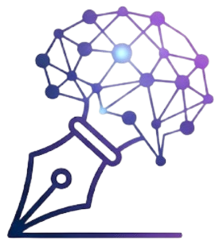

# Mind Matrix — Storytelling Client

> **Upgrade Your Mental Operating System** with a cinematic journaling, blogging, and series experience.



Welcome to the React front-end for **Mind Matrix**, a storytelling platform that blends personal journals, community blogs, narrative series, and live events into a single expressive space. This README is your guide to understanding the project, getting it running locally, and extending it with confidence.

---

## Table of Contents
1. [Overview](#overview)
2. [Key Features](#key-features)
3. [Tech Stack](#tech-stack)
4. [Architecture Notes](#architecture-notes)
5. [Quick Start](#quick-start)
6. [Available Scripts](#available-scripts)
7. [Environment & API Configuration](#environment--api-configuration)
8. [Project Structure](#project-structure)
9. [UI Highlights](#ui-highlights)
10. [Roadmap Ideas](#roadmap-ideas)
11. [Contributing](#contributing)
12. [License](#license)

---

## Overview
Mind Matrix provides a polished storytelling environment built with **Vite + React**. Readers can explore journals, blogs, episodic series, and events, while writers craft new pieces with intuitive forms and rich presentation layers.

- **Audience**: storytellers, readers, and community curators.
- **Goal**: deliver a delightfully immersive reading and writing experience with fast performance and modern aesthetics.
- **Status**: MVP-ready client that integrates with a Django/DRF-style backend.

---

## Key Features
- 🪄 **Hero Landing Experience** — Animated splash screen, ambient gradients, and interactive navigation.
- 📚 **Journal Workflows** — Filterable categories, personal + community views, bookmarking, and reading notes.
- 📰 **Blogs Hub** — Featured content grid, spotlight stories, and editorial presentation.
- 🎞️ **Series Explorer** — Multi-season narratives with detail pages and episode browsers.
- 🎟️ **Events Feed** — Upcoming sessions surfaced through the API to keep readers engaged.
- 👤 **Auth-Aware UI** — Conditional navigation, profile shortcuts, and sign-in/out flows.
- 📨 **Newsletter Capture** — Lightweight subscription path to grow the audience.
- ⚙️ **API Abstraction Layer** — Centralized fetch helpers with graceful error handling and token management.

---

## Tech Stack

| Layer            | Choice                         | Notes |
|------------------|--------------------------------|-------|
| Framework        | [React 18](https://react.dev/) | Hooks-first architecture |
| Build Tool       | [Vite 5](https://vitejs.dev/)  | Lightning-fast dev server |
| Routing          | React Router v6                | Nested routes, URL params |
| Animations       | Framer Motion                  | Micro-interactions and transitions |
| Styling          | Custom CSS + design tokens     | Aurora gradients, glassmorphism |
| State Persistence| Local Storage                  | Auth tokens, bookmarks, notes |

---

## Architecture Notes
- `src/App.jsx` defines the global layout, navigation shell, and route map.@client/src/App.jsx#1-175
- The `pages/` directory houses high-level views (Journal, Blogs, Series, Events, Auth, etc.).@client/src/pages/Journal.jsx#1-284
- Reusable UI elements (Hero, Grid, Footer, ReadingJournal) live in `src/components/`.
- API calls are centralized in `src/api.js`, bundling auth, blog, series, newsletter, and reading-journal endpoints.@client/src/api.js#1-193

---

## Quick Start

### Prerequisites
- **Node.js** ≥ 18.x (LTS recommended)
- **npm** ≥ 9.x

### Installation
```bash
# Install dependencies
yarn install  # or: npm install

# Launch the development server
yarn dev      # or: npm run dev
```
Vite will start on [http://localhost:5173](http://localhost:5173) by default.

---

## Available Scripts
Run these from the `client/` directory:

| Script        | Command           | Purpose |
|---------------|-------------------|---------|
| `dev`         | `npm run dev`     | Start the Vite dev server with hot module reload |
| `build`       | `npm run build`   | Generate an optimized production build |
| `preview`     | `npm run preview` | Serve the production build locally for QA |

Yarn equivalents (`yarn dev`, etc.) are fully supported.

---

## Environment & API Configuration
The client currently targets a backend running at `http://localhost:8000/api`. Adjust the base URL inside `src/api.js` if your API lives elsewhere.

```js
// src/api.js
const API_BASE_URL = 'http://localhost:8000/api'
```

For environment-based configuration, consider exposing a `VITE_API_BASE_URL` variable and reading it in `api.js`.

Authentication tokens and reading-journal data fall back to `localStorage` when API calls fail, ensuring a resilient UX even when offline.

---

## Project Structure
```text
client/
├─ index.html
├─ src/
│  ├─ App.jsx
│  ├─ main.jsx
│  ├─ api.js
│  ├─ components/
│  ├─ pages/
│  ├─ icons.jsx
│  └─ styles/
├─ Logo.png
├─ package.json
├─ vite.config.js
└─ README.md
```

---

## UI Highlights
- **Splash Screen**: animated glyphs, aurora gradients, and branded loading state.
- **Aurora-Themed Journal**: category filters, animated cards, and responsive grid layouts.
- **Adaptive Navigation**: highlights current route and surfaces auth-aware calls to action.
- **Story Cards**: dynamic gradients keyed to category type for instant visual context.

Screenshots and screen recordings can be added to the [`/docs`](./docs) directory (create if needed) and referenced here for visual documentation.

---

## Roadmap Ideas
1. Expose API base URL via environment variables to better support multiple environments.
2. Add component-level tests (React Testing Library) for critical flows (Journal filters, Auth, Newsletter).
3. Integrate real-time updates or notifications for new community journals and events.
4. Introduce theme toggles (light/dark) to enhance accessibility.

---

## Contributing
Contributions are welcome! To propose changes:
1. Fork the repository or create a new branch.
2. Run the app locally (`npm run dev`) and verify updates.
3. Submit a pull request summarizing the change, rationale, and testing notes.

Please keep styles consistent with the existing aurora/glass aesthetic.

---

## License
This project is proprietary to the Mind Matrix team. Contact the maintainers for licensing inquiries.

